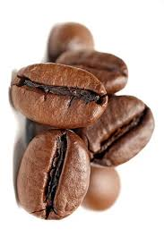

## Welcome to Ístroba

We are a high end coffee shop serving the finest single origin coffees
in Paris!

At this café you will find our passion for coffee is so strong that there
is not a single thing besides coffee on the menu!

The roasting processes occur in-house. You can always get freshly roasted
beans with caramelized sugar aroma. Beans are sourced from the rare coffee
trees in Meadville, Pennsylvania. The wash process bring out the finest
flavors!

## Reviews

Food critic and restaurateur who owns the lovely [cafe1](https://allegheny-college-cmpsc-105-spring-2024.github.io/lab05-resto-starter/), _name_, has
stated:

>" Ístroba has the most amazing coffee!"

[See their review in person!](https://allegheny-college-cmpsc-105-spring-2024.github.io/lab05-resto-starter/explorations/review1)

Another critic and restaurateur who owns the lovely [cafe2](https://allegheny-college-cmpsc-105-spring-2024.github.io/lab05-resto-starter/), _name_, has
stated:

>" Ístroba has the most terrible food!" 

[See their review in person!](https://allegheny-college-cmpsc-105-spring-2024.github.io/lab05-resto-starter/explorations/review2)
